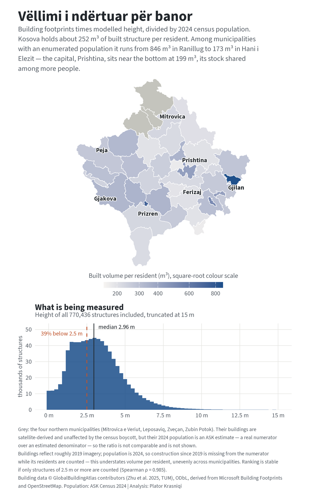

# Vëllimi i ndërtuar për banor — built volume per resident in Kosova

Reproducible R analysis of **how much built structure stands per resident in each
of Kosova's 38 municipalities**, combining satellite-derived 3D building models
with 2024 census population.

**The finding: Kosova holds about 252 m³ of built structure per resident, and the
figure is lowest where most people actually live.** It falls along a gradient
from small peripheral municipalities down to the populous urban core —
**Prishtina 199 m³, Ferizaj 202 m³, Prizren 228 m³** — where the same stock is
shared among more people. The full range across municipalities with an
enumerated population is given under Key results; its top end rests on very
small denominators, which is why the finding is framed around the gradient
rather than around which municipality ranks highest (see Limitations).



This is the piece's own measure, not an official indicator. It sits adjacent to
UN-Habitat's work on built-up area per capita, but it is **not** SDG 11.3.1 —
that indicator is the ratio of land consumption rate to population growth rate,
a two-period comparison of *area*, and nothing here should be read as reporting it.

## Data sources (all open)

- **GlobalBuildingAtlas LoD1** (Zhu et al. 2025, TUM) — global building polygons
  with modelled heights, read as GeoParquet from Source Cooperative. Kosova falls
  entirely within a single 5° tile, `e020_n45_e025_n40.parquet`; its western edge
  sits about 1.3 km inside the 20°E tile boundary, so no second tile is needed.
  **Building data © GlobalBuildingAtlas contributors, ODbL**, derived from
  Microsoft Building Footprints and OpenStreetMap. Within Kosova the split is
  roughly 68% Microsoft / 32% OpenStreetMap.
- **ASK Census 2024** — population by municipality, PxWeb table `census2024_00.px`.
- **Municipal boundaries** — geoBoundaries gbOpen **ADM2** (Kosova / `XKX`), 38
  municipalities, joined through the same reviewed name crosswalk used by the
  `census-vacancy` piece (`data/lookup_municipalities.csv`).

## Method

- **Built volume = geodesic footprint area × modelled LoD1 height**, summed per
  municipality, divided by 2024 census population.
- Footprint areas are planar in **UTM zone 34N (EPSG:32634)** rather than
  geodesic. A share of GBA footprints contain degenerate rings (duplicate
  vertices) that s2 rejects outright; GEOS accepts them. UTM 34N spans 18–24°E
  and therefore contains all of Kosova, where scale distortion is well under a
  percent — immaterial at building-footprint size.
- Each building is assigned to a municipality by **point-in-polygon on its own
  polygon centroid**, computed in the same pass as the area. 772,732 of the
  1,398,110 buildings in the Kosova bounding box fall inside a Kosova
  municipality; GBA's own country attribution flags 770,279, and the small
  difference is border-adjacent buildings resolved geometrically rather than by
  the dataset's country label.
- **Sentinel heights are dropped, never imputed.** GBA encodes missing heights as
  `-999` in both `height` and `var`. Inside Kosova that is **2,296 buildings,
  0.297%** of those assigned. **770,436 structures** remain.

## Key results

- **National: 403.3 million m³ of built volume, 97.8 km² of footprint, across
  770,436 structures — about 252 m³ per resident.**
- **The full range, enumerated population only: 846 m³ (Ranillug) to 173 m³
  (Hani i Elezit) — a 4.9× spread.**
- **Highest:** Ranillug 846 m³, Mamushë 725 m³, Kllokot 515 m³,
  Graçanica 425 m³, Partesh 419 m³ — all small municipalities, and all resting
  on denominators small enough to warrant the caution in Limitations.
- **Lowest:** Hani i Elezit 173 m³, Fushë Kosova 176 m³, Shtime 194 m³,
  Skenderaj 197 m³, Kaçanik 198 m³.
- **The large urban municipalities cluster near the bottom:** Prishtina 199 m³,
  Ferizaj 202 m³, Prizren 228 m³, Gjilan 270 m³, Peja 275 m³.
- **What is being counted:** median structure height is **2.96 m** and **39.5%
  of structures stand below 2.5 m**. A large share of the dataset is therefore
  ancillary — sheds, garages, agricultural and outbuildings — not dwellings.
  These are included, because "built volume" means all built structure and any
  height cut-off would be an unfalsifiable judgment call.
- **Sensitivity to that choice:** counting only structures of 2.5 m or more
  lowers every municipality's figure but barely moves the ordering —
  **Spearman ρ = 0.985**, maximum rank shift **5 places** across 38
  municipalities. The ranking is not an artefact of including small structures.

## Handling the northern four

Mitrovica e Veriut, Leposaviq, Zveçan and Zubin Potok are shown **grey** and are
excluded from the quoted range. Their buildings are satellite-derived and so are
entirely unaffected by the 2024 census boycott, but their 2024 population figures
are ASK **estimates** — **a real numerator over an estimated denominator**. The
ratio is not comparable with the other 34 and is not presented as such. For
reference the computed values are Zveçan 924 m³, Zubin Potok 570 m³,
Leposaviq 438 m³ and Mitrovica e Veriut 326 m³; the first of those would
otherwise top the national ranking, which is precisely why it is not shown.

## Reproduce

R ≥ 4.5; packages: `arrow, sf, dplyr, tidyr, readr, pxweb, ggplot2, ggrepel,
showtext, patchwork, magick`. Run from the piece root, in order:

```
Rscript R/02_pull_gba.R          # ~167 MB raw clip -> data/raw/ (gitignored)
Rscript R/03_pull_population.R   # ASK Census 2024 population
Rscript R/04_build_municipal.R   # areas, join, aggregate (~1 min)
Rscript R/05_figure.R            # figure (2000px + 1200px)
```

`R/01_functions.R` holds shared helpers and is sourced by the others.

**The raw GlobalBuildingAtlas clip is not in this repository.** At ~167 MB it
exceeds GitHub's 100 MB per-file limit, so `data/raw/*.parquet` is gitignored and
`R/02_pull_gba.R` regenerates it. The exact pull is a bounding-box filter pushed
down to the GeoParquet `bbox` struct, so the full 10.4-million-row tile is never
materialised:

```r
fs <- arrow::S3FileSystem$create(anonymous = TRUE, region = "us-west-2")
ds <- arrow::open_dataset(
  "us-west-2.opendata.source.coop/tge-labs/globalbuildingatlas-lod1/e020_n45_e025_n40.parquet",
  filesystem = fs)
ds |> dplyr::filter(bbox$xmin < 21.8094, bbox$xmax > 19.9921,
                    bbox$ymin < 43.2875, bbox$ymax > 41.8377) |> dplyr::collect()
```

The derived per-building table and the municipal aggregate **are** committed, so
every published number can be checked without re-downloading.

## Outputs

- `output/built_volume_per_resident.png` — lead figure (2000px), and a 1200px
  LinkedIn version downscaled from it.
- `data/processed/municipal_built_volume.csv` — per municipality: population,
  building count, footprint, volume, volume per resident, the ≥2.5 m sensitivity
  and both rankings.
- `data/processed/buildings_kosova.parquet` — per building, WKB dropped:
  id, source, municipality, height, area, volume, centroid.
- `data/processed/population_2024.csv` — the denominator.

## Limitations

- **Vintage mismatch, and it has a direction.** GBA reflects roughly **2019**
  imagery; the population denominator is **2024**. Kosova's dwelling stock grew
  **78% between the 2011 and 2024 censuses** (see the `census-vacancy` piece), so
  whatever share of that construction happened after 2019 is **absent from the
  numerator while its residents are fully counted in the denominator**. This
  **systematically understates** built volume per resident — and does so
  **unevenly**, biting hardest in the fastest-building municipalities. Fushë
  Kosova, second-lowest here at 176 m³, is also the fastest-growing municipality
  in the country; some part of its low figure is this artefact rather than
  density.
- **A real numerator over an estimated denominator** for the northern four, as
  above. The national figure uses **1,602,515**, the census total *including*
  those ASK estimates; the separately published *registered* enumeration was
  **1,586,659**, which would raise the national figure by about 1%.
- **Modelled heights, not measured ones.** LoD1 heights are model output with a
  published per-building variance (`var`), not survey measurements. A median of
  2.96 m is low for a housing stock that is typically two storeys, which points
  to both the large ancillary-structure share and possible downward bias in the
  height model. Volumes should be read as an internally consistent index for
  comparison across municipalities, not as an engineering estimate of cubic
  metres built.
- **Mixed footprint provenance.** Roughly a third of Kosova's footprints come
  from OpenStreetMap, whose completeness varies with mapper activity, and the
  rest from an automated Microsoft extraction. Neither is a cadastre, and
  detection of small or closely-spaced structures differs between them.
- **Small denominators are volatile.** Municipalities of roughly 10,000 residents
  or fewer produce ratios far more sensitive to population error and to seasonal
  absence than large ones — a few hundred people either way moves the figure by
  much more than the same error would in Prishtina. **Ranillug (2,481 residents),
  Kllokot (3,041), Partesh (3,240) and Mamushë (5,607)** all sit at or near the
  top of the ranking on denominators of that size, which compounds the
  residence-versus-presence problem described below. This is why the piece frames
  its finding around the gradient from periphery to urban core rather than around
  which municipality ranks highest.
- **Population is residence, not presence.** The census counts usual residents.
  Municipalities with large diaspora or seasonal populations will show high
  volume per resident partly because their buildings stand empty much of the
  year — the same effect documented in the `census-vacancy` piece.
- **Descriptive only.** This is a ratio of two measured quantities at one point
  in time. Nothing here identifies why any municipality sits where it does.

---

*Building data © GlobalBuildingAtlas contributors (Zhu et al. 2025, TUM), ODbL,
derived from Microsoft Building Footprints and OpenStreetMap. Population: ASK,
Census 2024. Boundaries: geoBoundaries ADM2. Analysis: Plator Krasniqi.*
