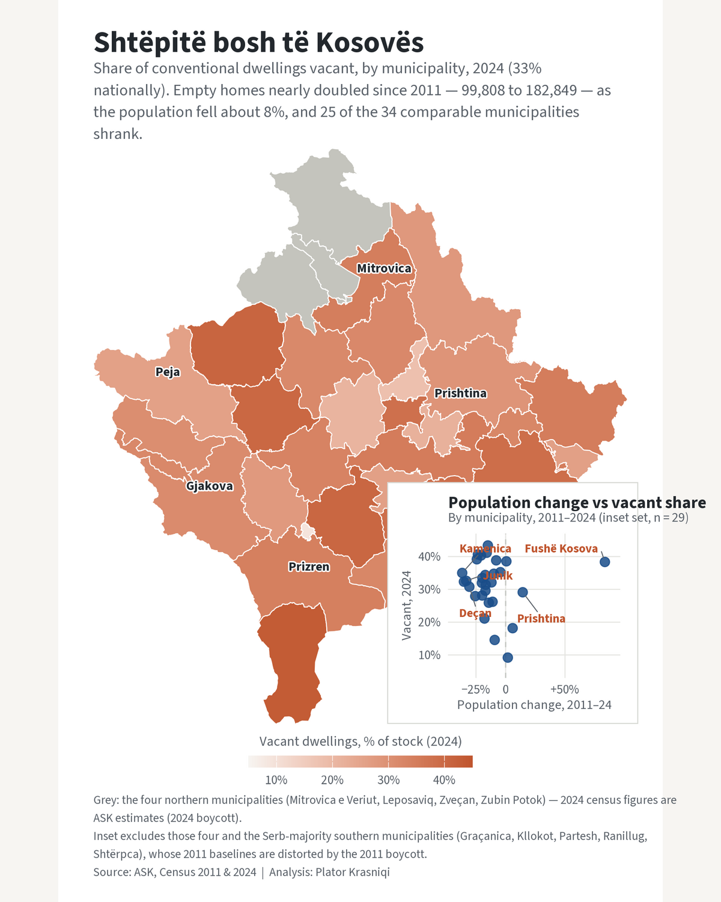

# Shtëpitë bosh të Kosovës — Kosova's empty homes

Reproducible R analysis of **vacant dwellings across Kosova's 38 municipalities**,
comparing the 2011 and 2024 censuses.

**One finding: the population shrank while the housing stock ballooned, leaving a
fast-growing stock of empty homes.** Between the two censuses Kosova's recorded
population fell about **8%** (25 of the 34 municipalities with a comparable count
lost residents), yet the stock of conventional dwellings grew **78%** — and
**vacant dwellings nearly doubled, from 99,808 (2011) to 182,849 (2024)**.
Nationally, about **one in three dwellings (33%) stood vacant in 2024**.

The lead figure maps the 2024 vacant-dwelling share by municipality, with a panel
below relating each municipality's 2011–2024 population change to its 2024 vacancy.

## Data sources (all open)

- **ASK — Kosovo Agency of Statistics, PxWeb API** (`askdata.rks-gov.net`, English database):
  - `census2024_00.px` — *Population by age, sex and municipality, 2011 and 2024.*
  - `census2024_51.px` — *Buildings and dwellings (inhabited and vacant), national and municipal, 2011 and 2024.*
- **Municipal boundaries** — geoBoundaries gbOpen **ADM2** (Kosova / `XKX`), 38
  municipalities; names standardised to Albanian through a reviewed lookup
  (`data/lookup_municipalities.csv`).

This piece combines administrative boundary data with census statistics; the
association it shows (shrinking municipalities tending to have more empty homes)
is **descriptive, not causal**.

## Method

- Population and dwelling tables are pulled programmatically from the ASK PxWeb API
  (`pxweb`), saved raw, then reduced to one row per municipality per census.
- **Vacancy share = vacant conventional dwellings ÷ all conventional dwellings**, 2024.
- Population and vacancy are joined to the ADM2 polygons through an **explicit
  municipality name lookup**, verified as a complete one-to-one match across all
  three sources — the two ASK tables themselves spell several municipalities
  differently (e.g. `Gllogovc` / `Gllogoc` / **Drenas**, `Zveqan` / **Zveçan**), so
  no names are matched silently.

## Key results

- **Vacant dwellings: 99,808 (2011) → 182,849 (2024)** — nearly doubled.
- **Conventional stock: 312,711 → 556,779 (+78%)**.
- **National vacancy share: 31.9% → 32.8%.** The *share* barely moved because the
  stock grew almost as fast as the vacant count — the story is the near-doubling of
  empty homes alongside population decline, not a jump in the vacancy rate.
- **Population ≈ −8% nationally**; 25 of the 34 comparable municipalities lost
  people. Only five grew for real, led by **Fushë Kosova (+84%)** and
  **Prishtina (+14%)** — the peri-urban belt around the capital.
- Vacancy is highest in high-emigration highland and western municipalities
  (**Dragash 43%, Istog 41%, Suhareka 41%, Klina 40%**) and lowest in **Mamushë (9%)**.

## Handling the census boycotts

- **Northern four** (Mitrovica e Veriut, Leposaviq, Zveçan, Zubin Potok): 2024
  figures are ASK **estimates** (2024 boycott) and there is **no 2011 count**. Shown
  **grey** on the map and **excluded from the scatter**.
- **Serb-majority southern** municipalities (Graçanica, Kllokot, Partesh, Ranillug,
  Shtërpca): their 2011 baselines are depressed by the **2011 boycott**, so
  2011→2024 change is not meaningful (apparent "growth" of +50% to +80%). They
  appear on the map but are **excluded from the scatter**.

## Reproduce

R ≥ 4.5; packages: `pxweb, dplyr, tidyr, readr, sf, ggplot2, ggrepel, showtext,
patchwork, scales, magick, jsonlite`. Run from the piece root, in order:

1. `R/02_pull_population.R` — population by municipality (2011, 2024).
2. `R/03_pull_vacancy.R` — conventional + vacant dwellings (2011, 2024).
3. `R/build_lookup.R` — (re)generate the reviewed name crosswalk
   `data/lookup_municipalities.csv` and verify it is a complete 1:1 match across all
   three sources. Kept out of the numbered sequence because the crosswalk is a
   reviewed artifact, not something to regenerate silently on every run.
4. `R/04_build_join.R` — join to geoBoundaries via the lookup, with assertions.
5. `R/05_figure.R` — render the figure (2000px + 1200px LinkedIn).

`R/01_functions.R` holds shared helpers and is sourced by the others. Raw API pulls
and the boundary file are cached under `data/raw/` on first run.

## Outputs

- `output/census_vacancy_2024.png` — lead figure (2000px).
- `output/census_vacancy_2024_linkedin_1200.png` — LinkedIn version (1200px wide).
- `data/processed/analysis_municipalities.csv` — per-municipality population,
  dwellings, vacancy share, and flags.

## Limitations

- **Northern estimates.** The four northern municipalities boycotted the census;
  their 2024 population and dwelling figures are ASK **estimates** and they have no
  2011 census. They are greyed on the map and left out of the scatter. The national
  2024 total used here (**1,602,515**) *includes* these estimates; the separately
  published *registered* enumeration was **1,586,659**.
- **2011 boycott distortion.** Serb-majority southern municipalities were
  under-enumerated in 2011, so their 2011→2024 change is unreliable; they are
  excluded from the population-change scatter (kept on the map).
- **Vacancy includes seasonally occupied diaspora homes.** The census counts a
  dwelling as vacant when it is not in use as a usual residence on census night —
  which includes homes owned by the diaspora and lived in only seasonally. This
  **supports rather than undermines** the reading of the piece: a large, growing
  stock of dwellings that are built but not permanently occupied is consistent
  with high emigration and diaspora home-building. It is noted here as context,
  not as a flaw in the data.
- **Self-reported enumeration, not observed occupancy.** Vacancy is a point-in-time
  census classification recorded by enumerators, not a metered or continuously
  observed measure of whether a dwelling is lived in.
- **Different denominators across censuses.** The national −8% compares the 2011
  count (34 municipalities, no north) with the 2024 count (38, north estimated);
  restricted to the 34 municipalities enumerated both years, the decline is somewhat
  steeper.

---

*Data: ASK (Kosovo Agency of Statistics), Census 2011 & 2024; geoBoundaries ADM2.
Analysis: Plator Krasniqi.*
