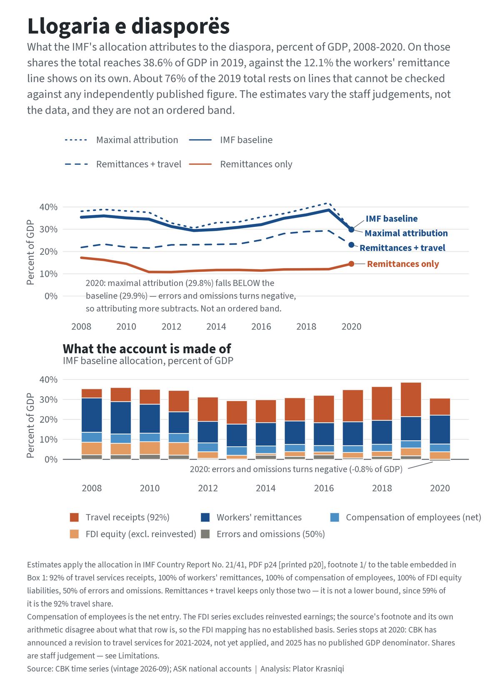

# Llogaria e diasporës — the diaspora account

Reproducible R reconstruction of **what the IMF's allocation attributes to
Kosova's diaspora beyond remittances**, 2008–2020, applying the shares used in
the 2020 Article IV consultation to CBK's published balance of payments.

**One finding: the number Kosova's public conversation runs on is a fraction of
what that allocation attributes to the diaspora.** On the IMF's own shares, the
allocation puts diaspora-attributed inflows at **38.6% of GDP in 2019**, against
the **12.1%** that the workers' remittance line shows on its own — a difference
of **26.5 percentage points** and a ratio of **3.2**.

Those are properties of the allocation, not measurements of the diaspora. **About
76% of the 2019 total rests on lines that cannot be checked against any
independently published figure**, 10% on a mapping selected to match the source
rather than established from it, and 14% on lines that can be independently
checked. Read the Limitations before the number.



The series stops at 2020. See Limitations.

## Data sources (all open)

Page citations give the **PDF page of the cached file**, with the report's own
printed folio in brackets where they differ.

- **CBK — Banka Qendrore e Republikës së Kosovës**, Statistikat › Seritë kohore
  (`bqk-kos.org/repository/docs/time_series/`). Twelve Excel workbooks, cached as
  dated vintages; the piece is built on `vintage_2026-09`. Seven series are
  extracted — five enter the account, two are alternative FDI treatments:
  - `29 Secondary Income.xls` — workers' remittances, `967.1DF00Z.c.O.A.6` (credit)
  - `27 Services.xls` — travel receipts, `967.1BD000.C.X.N.6` (credit)
  - `28 Primary Income.xls` — compensation of employees, `967.1CA000.B.X.A.6` (net)
  - `33.1 Direct_investment_flows_In_&_Out.xls` — FDI equity excluding reinvested
    earnings (no code published) — the FDI series used
  - `26 Balance of payments - main components.xls` — errors and omissions (no code published)
  - `30 Financial account.xls` — FDI equity *including* reinvested earnings, variant
  - `33.1` again — inward equity, directional presentation, variant
- **ASK — Agjencia e Statistikave të Kosovës**, PxWeb. `gdp13.px` (GDP by
  expenditure, current prices, 2008–2024) is the denominator; `gdp09.px` is read
  as a consistency check.
- **IMF Country Report No. 21/41**, *Republic of Kosovo: 2020 Article IV
  Consultation*, February 2021, 89 pp. Cached as a reference document.
- **CBK, Metodologjia e përpilimit të BP dhe PIN** — compilation methodology.

No proprietary or paywalled inputs. No institutional affiliation.

## Method

The allocation is stated in **footnote 1/ to the table embedded in Box 1**, PDF
p24 [printed p20] — the footnote belongs to that table, not to the box:

> "the diaspora is assumed to explain **92 percent of travel services receipts**
> (diaspora-related tourism), and **100 percent of workers' remittances**.
> Compensation of employees (which is driven by seasonal migrants and thus not
> properly diaspora) **is included as diaspora**. Staff assumed that **equity
> liabilities under foreign direct investment fully comprise real estate
> purchases** by the diaspora. Finally, **50 percent of errors and omissions**
> are assumed to be unrecorded remittances or equity investments not captured in
> other lines."

Both the footnote and its table sit in the figure layer of the PDF and are
invisible to text extraction; they were read from a 400 and 600 dpi raster.

1. `R/02_pull_cbk.R` — downloads the workbooks into a vintage-stamped directory,
   byte-for-byte, logging URL, download time, `Last-Modified`, size and MD5.
   Asserts on exit that no other vintage was modified.
2. `R/02a_pull_ask_gdp.R` — pulls both ASK GDP tables behind a magnitude guard.
3. `R/03_inspect.R` — reconnaissance. Writes nothing.
4. `R/04_parse_components.R` — extracts the annual series, anchored on BPM6 codes
   where published or on label text where not.
5. `R/05_parse_subannual.R` — quarterly and monthly blocks, dated by propagating
   from year-stamped rows with every stamp asserted.
6. `R/06_diaspora_account.R` — applies the shares, builds five bands across four
   FDI treatments, and runs the comparison against CR 21/41.
7. `R/07_figures.R` — the figure.
8. `R/08_readme_numbers.R` — **computes every number quoted here** and writes
   `data/processed/readme_numbers_2026-09.txt`.

### Two mapping changes made during construction

- **Compensation of employees: credit → net.** *Measured.* Table 5 (PDF p37
  [printed p33]) publishes 237 and 257 for 2018 and 2019; CBK's net column gives
  237.04 and 257.13. The credit column, used in earlier drafts, overstates by the
  debit.
- **FDI equity: including → excluding reinvested earnings.** *Calibrated, not
  measured.* Excluding them gives 3.203% of GDP averaged over 2018–19 against the
  3.2 Box 1 prints; including them gives 3.634%. The switch was made because it
  matched the source, which is calibration. It is not independent evidence, and
  the section below shows the match is a coincidence with a different concept.

### Five bands, not a band

- **Remittances + travel** — remittances plus 92% of travel receipts. **Not a
  floor**: 59% of it is the 92% travel share, the least established assumption
  here.
- **IMF baseline** — the full allocation as published.
- **Maximal attribution** — travel at 100%, errors and omissions at 100%.
- **Travel at 70% / travel at 50%** — the full allocation with the travel share
  reduced. The published shares never vary travel downward; travel is **45%**
  of the 2019 account, so these matter.

2019, percent of GDP: baseline **38.62**, travel at 70% **34.50**, travel at 50%
**30.75**. The estimates are **not ordered** — see Limitations.

### What the comparison against CR 21/41 establishes

**This is not a replication.** The IMF's figures and these are computed from the
same source by the same formula. Agreement tests series identification, share
application and vintage stability. It tests nothing about whether the allocation
measures anything.

The lines divide three ways, and the division is weighted:

| Box 1 line | Status | Why |
|---|---|---|
| Primary income (compensation of employees) | **VALIDATED** | Table 5 publishes the concept independently |
| Net errors and omissions | **VALIDATED** | Table 5 publishes the concept independently |
| Direct investment, net | **CALIBRATED** | no equity/reinvested split in Table 5; mapping selected to match Box 1 |
| Exports of goods and services (travel) | **UNVERIFIABLE** | Table 5 gives total services receipts, not travel |
| Secondary income, other (remittances) | **UNVERIFIABLE** | Table 5 gives "Other transfers (incl. remittances), net" |

**Shares of the account, by year:**

| | 2008 | 2011 | 2014 | 2017 | 2019 | 2020 |
|---|---|---|---|---|---|---|
| UNVERIFIABLE | 61.7 | 62.4 | 77.6 | 80.4 | **75.9** | 77.0 |
| CALIBRATED | 17.8 | 18.3 | 2.9 | 7.8 | **10.2** | 12.7 |
| VALIDATED | 20.5 | 19.3 | 19.5 | 11.8 | **14.0** | 10.3 |

In 2019 that is **76 / 10 / 14**. Independently checkable lines carry about a
seventh of the account.

Averaged over 2018–19, percent of GDP on the IMF's own denominator:

| Line | Box 1 | Here | Deviation |
|---|---|---|---|
| Exports of goods and services | 17.0 | 16.96 | −0.04 |
| Primary income | 3.5 | 3.57 | +0.07 |
| Secondary income (other) | 11.9 | 11.95 | +0.05 |
| Direct investment, net | −3.2 | −3.20 | **0.00** |
| Net errors and omissions | 1.4 | 1.59 | +0.19 |
| **Overall balance** | **37.1** | **37.26** | **+0.16** |

**The direct-investment line deviates by exactly zero because the mapping was
chosen to land there.** In 2020 the same mapping deviates by **−1.26 pp**.

Decomposing the total gap, in percentage points of GDP:

| | Denominator | Series | Total |
|---|---|---|---|
| avg 2018–19 | +0.278 | +0.163 | **+0.441** |
| 2020 | +0.199 | +0.571 | **+0.770** |

The denominator column is the difference between ASK's current GDP and the IMF's
own (6,726 / 7,104 / 6,817, PDF p4). Within the series column, the
errors-and-omissions revision is the one measured contribution: Table 5 gives 184
and 215 where the current vintage gives 193.02 and 247.25, and **half that
difference is +0.147 pp** of GDP. The rest of the +0.19 pp shown on the E&O line
is Box 1's one-decimal rounding.

### Parent validation

The Box's **Total** column can be checked against the same lines in CBK's own
published totals. Averaged over 2018–19, on IMF GDP, **nine of twelve lines
validate** within 0.15 pp: current account (−6.59 against −6.5), exports (28.97
against 29.0), imports, primary income, secondary income, capital account, direct
investment, portfolio investment and reserve assets. **Three do not**: financial
account (+0.24), other investment (+0.20) and net errors and omissions (+0.28).

For **2020 almost nothing validates** — only imports and primary income. That is
expected: the IMF's 2020 column is a projection built on data through 2020:Q3,
and the current account alone has since been revised from −509 to −472.2 EUR
million.

### The residents' side

Box 1's Residents column gives a current account of **−39.0%** of GDP averaged
over 2018–19 and **−34.1%** in 2020. Taking CBK's current account less the
diaspora-attributed current-account components, on IMF GDP, gives **−39.067%**
and **−33.629%** — deviations of **−0.067 pp** and **+0.471 pp**.

The diaspora side and the residents side are the same identity from opposite
ends. They are not independent tests, and both are reported so the arithmetic is
visible.

### The travel share, against the report's own chart

Travel receipts are **63.9%** of exports of goods and services in 2019 and
**55.5%** in 2013 on this vintage. PDF p24's prose says "close to 70 percent" for
2019. Its second figure, a cross-country scatter with 2013 on the x axis and 2019
on the y, places Kosova at approximately **x ≈ 55, y ≈ 64**, read to about
**±2 pp**. Both computed values fall inside that tolerance.

## Key results

- **38.6% of GDP in 2019** on the IMF baseline, against **12.1%** for remittances
  alone: a difference of 26.5 percentage points and a ratio of 3.2. Both are
  arithmetic on the allocation.
- Composition in 2019, percent of GDP: travel receipts at 92% **17.23**, workers'
  remittances **12.07**, FDI equity excluding reinvested earnings **3.92**,
  compensation of employees net **3.64**, errors and omissions at 50% **1.75**.
- The account runs from **35.4% of GDP in 2008** to a low of **29.4% in 2013** and
  a high of **38.6% in 2019**.
- **2020: 29.9% of GDP.** Travel receipts fall 52.5% that year. Workers'
  remittances rise 15.1%. No relationship between the two movements is
  established here.
- Varying the travel share alone moves 2019 from 38.6% to **34.5%** at 70% and
  **30.8%** at 50%. Dropping FDI entirely gives **34.7%**.

## Reproduce

R ≥ 4.5, enforced at the top of `R/01_functions.R`. Packages: `dplyr, tidyr,
readr, tibble, readxl, pxweb, ggplot2, ggrepel, showtext, patchwork, scales,
magick, pdftools`. Run from the piece root, in order:

```
Rscript R/02_pull_cbk.R 2026-09
Rscript R/02a_pull_ask_gdp.R
Rscript R/03_inspect.R 2026-09
Rscript R/04_parse_components.R 2026-09
Rscript R/05_parse_subannual.R 2026-09
Rscript R/06_diaspora_account.R 2026-09
Rscript R/07_figures.R 2026-09
Rscript R/08_readme_numbers.R 2026-09
```

`R/02_pull_cbk.R` creates `data/raw/vintage_2026-09/` and fills it; once cached,
a workbook is never re-downloaded. `R/05` and `R/07` write nothing unless every
guard passes.

## Outputs

- `output/diaspora_account_2008_2020.png` — lead figure (2000px) and 1200px version
- `data/processed/components_annual_2026-09.csv` — the seven series, annual
- `data/processed/components_subannual_2026-09.csv` — quarterly and monthly
- `data/processed/diaspora_account_2026-09.csv` — five bands × four FDI treatments
- `data/processed/gdp_nominal_annual.csv` — denominator
- `data/processed/readme_numbers_2026-09.txt` — every number quoted above
- `data/processed/guard_report_2026-09.txt`, `subannual_guard_report_2026-09.txt`,
  `benchmark_report_2026-09.txt` — every assertion and its result

The matching `_2026-08` files are the prior vintage, retained as the evidence for
the no-change comparison. The announced revision to travel services had not
landed as of the September pull: the two vintages are identical on every annual
series this piece uses, and the `_2026-08` outputs are kept so that can be
checked rather than taken on trust.

## Limitations

- **The allocation shares are staff judgement, not measurement.** All five are
  assumptions stated in a footnote, not estimated quantities with standard
  errors. CR 21/41 describes them as resting on "available data, and expert CBK
  judgement", and flags one as doubtful in its own terms: compensation of
  employees "is driven by seasonal migrants and thus **not properly diaspora**",
  yet is included. Varying them shows how far the total moves; it is not a
  confidence interval, and nothing here validates the shares.
- **Three-quarters of the account cannot be independently checked.** In 2019,
  76% of the total is travel and remittances, for which Table 5 publishes only
  parent aggregates; 10% is FDI, whose mapping was selected to match the source;
  14% is compensation and errors and omissions, the only lines with an
  independently published counterpart. The comparison against CR 21/41 therefore
  bears on about a seventh of the number.
- **The FDI mapping has no established basis, and the source contradicts
  itself.** The footnote says the diaspora row is equity liabilities under FDI.
  But Box 1's own arithmetic — Total −3.1 = Residents +0.1 + Diaspora −3.2 —
  identifies that row with **whole-economy net direct investment**, which Table 5
  puts at **−3.095%** of GDP. Equity liabilities are **+3.894%**, nowhere near
  −3.2. The two readings cannot be reconciled from the published material. The
  series used here averages 3.203%, close to the printed 3.2, but that is a
  **coincidence with a different concept**, not evidence: on the Box's own
  arithmetic the row is net DI. The 2020 test fails at **−1.26 pp**. An
  FDI-excluded variant is carried for this reason: dropping FDI entirely gives
  **34.7%** of GDP for 2019 against 38.6%.
- **Travel is never varied downward in the published shares, and it is 45% of the
  account.** The 92% share is applied to a total that includes non-diaspora
  tourism and business travel, and CBK's methodology (p27) describes travel
  receipts as incorporating modelled elements — non-resident international staff
  assumed to spend about 14% of salary in Kosova, for instance. Reducing the
  share to 70% takes 2019 from 38.6% to **34.5%**; to 50%, to **30.8%**. The
  "remittances + travel" band is **not a lower bound**: 59% of it is that same
  travel assumption.
- **The account mixes gross and net quantities.** Travel receipts and remittances
  are gross current-account credits; compensation is a net current-account entry;
  FDI equity is a financial-account item; errors and omissions is a residual.
  Adding them produces a number with no single accounting interpretation. It is
  the IMF's construction, reproduced faithfully, but it is not a
  balance-of-payments aggregate in the sense that "exports" is.
- **Adding half of errors and omissions double counts by construction.** Errors
  and omissions is the residual that makes the balance of payments balance — it
  is defined by the other lines, including travel and remittances. If travel or
  remittances are mis-measured, the error reappears in errors and omissions with
  the opposite sign. Attributing 50% of it therefore adds back part of what the
  other components already carry, in an amount and direction that cannot be
  determined from published data.
- **The comparison has a resolution floor.** Box 1 prints to one decimal, so its
  rows are resolved only to about **±0.05 pp**, which on average 2018–19 GDP of
  6,915 EUR million is **±3.5 EUR million**. The travel line's −0.04 pp deviation
  therefore bounds any revision at roughly **7.1 EUR million** of travel credits.
  It does not establish that travel was unrevised.
- **The three plotted estimates are not an ordered band.** Errors and omissions is
  negative in 2020, so attributing 100% of it yields a *smaller* total than 50%:
  maximal attribution falls **0.051 pp below** the baseline that year, 29.8%
  against 29.9%. 2020 is the only inverted year in the plotted window. The
  estimates are drawn as three lines, never as a shaded interval.
- **A step in travel services in 2011, undocumented.** Travel credits rise
  **62.2%** in 2011, from 327.7 to 531.6 EUR million, and travel's share of
  exports of goods and services moves from **37.5%** in 2010 to **46.8%** in 2011
  and **54.1%** in 2012, never falling back below the 2010 level to 2020 — its
  lowest reading afterwards is **42.7%**, in the pandemic year. Four explanations
  have been excluded: the BPM5-to-BPM6 transition, which PDF p84 dates to
  2013:Q1; the documented tourism revision, which PDF p52 [printed p48] fn2
  covers for 2017:Q1–2019:Q2 only; an annual-compilation artefact, since the
  quarterly travel series reproduces the annual figure to within 1.1e-13 across
  2009–2012; and a change in compilation precision, since across 2009–2012 — the
  first four years with complete quarterly blocks — the only quarterly-to-annual
  deviations among 22 component-years are errors and omissions in 2009 and 2010.
  Neither CBK's methodology nor the IMF's assessment records a change to travel
  compilation that year. Reported as observed and unexplained.
- **The series stops at 2020, and what is withheld is large.** CBK announced that
  revised services statistics for **2021–2024** would be published in September
  2026; as of the 2026-09 vintage the revision has not been applied and the note
  remains future-tense. Travel receipts are the largest component of the account,
  so a revision to them moves the headline directly. On this vintage those years
  compute to **42.0%, 43.5%, 45.1% and 46.3% of GDP** — all above every year in
  the plotted window. They are flagged provisional and excluded from every
  figure. 2025 is excluded additionally because ASK publishes no 2025 annual GDP.
- **CBK does not republish its workbooks atomically.** The services balance for
  2025 differs by exactly **2.000 EUR million** between `26 Balance of payments -
  main components.xls` and `27 Services.xls`. The discrepancy reproduced
  unchanged in the September vintage. It is recorded as observed and not
  reconciled; no explanation is offered.
- **Three quarterly component-years do not reconcile to their own annual
  figures**, and are carried with a discrepancy flag rather than corrected:
  compensation of employees 2021 (−5.17 EUR million, attributable to Q3 and Q4
  because the monthly series reconciles exactly) and errors and omissions in 2009
  (+0.39) and 2010 (−0.42), which cannot be attributed to a quarter because the
  monthly series begins in 2014. Every other complete quarterly component-year
  from 2009 to 2025 reconciles exactly.
- **FDI equity is assumed to be entirely residential purchase.** No published
  series separates residential from other equity investment, so the size of that
  assumption cannot be established. The presentation choice matters as well: the
  series used here and the directional series CBK publishes separately carry data
  in **14 common years and disagree in all 14**, by up to **145.7 EUR million**
  (2018).
- **Errors and omissions is a residual that changes sign**, containing much
  besides unrecorded remittances. Attributing half of it is an assumption about a
  quantity defined by what could not be measured.
- **Neither denominator check is independent.** ASK's expenditure and production
  GDP tables agree to 0.000 EUR million in every year 2008–2024 — they are
  identical, so reading both confirms that two published tables carry the same
  aggregate, which catches a wrong-row selection but is not a check on the level.
  Likewise ASK's "exports of goods and services" matches the CBK-derived figure
  in **14 of 17 years** and exactly in 2019, the benchmark year, with a maximum
  difference of 77.37 EUR million in 2022 — ASK takes services trade from CBK's
  balance of payments, so the two are not separately sourced.
- **The account has no international comparator.** No equivalent consolidated
  diaspora account exists for other countries, so this figure cannot be ranked
  against them. Cross-country comparison is possible only on the remittance line,
  which is the narrow measure this piece sets out to widen.

- **The source workbooks are not shipped with this repository.** CBK's twelve
  Excel files and the two cached PDFs are downloads from third parties, not open
  data with a redistribution licence, so they are fetched rather than republished:
  `R/02_pull_cbk.R` retrieves them into `data/raw/vintage_2026-09/`. What is
  published instead is the download log — `data/raw/vintage_2026-09/_download_log.csv`
  and its counterparts — carrying the source URL, the pull timestamp, the byte
  size and the hash of every file, so anyone re-running the pull can verify they
  hold the same bytes this piece was built on. The ASK extracts are published in
  full: PxWeb is an open API and the two CSVs are our own queries against it. A
  consequence to state plainly: if CBK moves or withdraws a workbook, the pull
  will not reproduce, and the download log will then be the only record of what
  was retrieved.

---

*Data: CBK, Seritë kohore (vintage 2026-09); ASK, Llogaritë kombëtare; IMF
Country Report No. 21/41. Analysis: Plator Krasniqi.*
