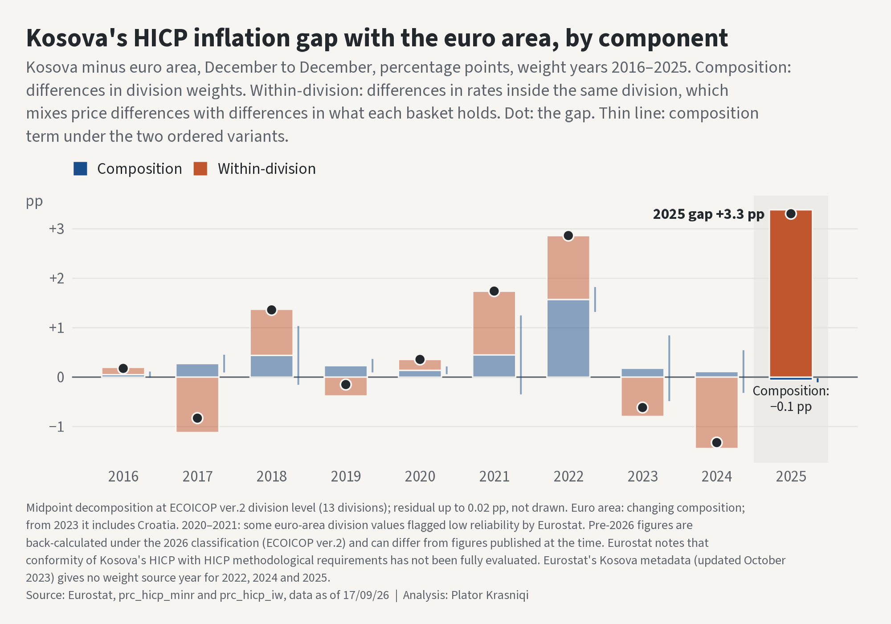

# Hendeku i inflacionit me zonën e euros — Kosova's inflation gap with the euro area

Reproducible R analysis that splits the gap between Kosova's and the euro area's consumer-price inflation (HICP, December to December) into a **composition** part and a **within-division** part, across the 13 ECOICOP ver.2 divisions, for weight years 2016–2025.

**The finding: in 2025, Kosova's consumer prices rose 5.3% from December to December against 2.0% in the euro area, a gap of +3.3 pp, and the within-division term (+3.4 pp) is larger than the whole gap, with composition slightly negative (−0.1 pp).** That holds under both orderings of the decomposition (see the dominance rule below). Over 2016–2025 as a whole the gap averaged +0.7 pp a year, but which part is larger depends on the ordering, so no dominance statement is made for the window.

*Composition* is the part of the gap that comes from the two areas spending different shares on each division. *Within-division* is the part that comes from different inflation inside the same division. It mixes price differences for the same goods with differences in what each area's basket holds inside a division; division-level data cannot separate the two. Both are accounting splits of the gap, not explanations of it: why prices within these divisions rose faster in Kosova is not identified here.



## Data sources (all open)

All from Eurostat's database, *Economy and finance > Prices > Harmonised index of consumer
prices (HICP) > Harmonised index of consumer prices (HICP) - ECOICOP ver.2*:

- **`prc_hicp_minr`** — HICP - ECOICOP ver.2 - indices and rates of change, monthly data.
  Units used: `I25` (Index, 2025=100) for every calculation; `I15` (Index, 2015=100) only for
  a cross-check; `RCH_A` (Annual rate of change) only for the gate; `RCH_MV12MAVR` (Moving
  12 months average rate of change) only for the reference column. All-items is `TOTAL`.
- **`prc_hicp_iw`** — HICP - ECOICOP ver.2 - item weights, per mille. Eurostat's dataset
  description states that each country's item weights add up to 1,000 in every year
  ([Data Browser](https://ec.europa.eu/eurostat/databrowser/view/prc_hicp_iw/default/table),
  retrieved 2026-09-23).
- **COICOP 2018 codelist** (`ESTAT/COICOP18`, the version referenced by the `prc_hicp_minr`
  data structure definition) — division labels, used verbatim.

Geographies: `XK` (Kosova; the source labels it `Kosovo*`) and `EA`, the euro area with its membership as it changed over time. Vintage: Eurostat release of 17 September 2026, downloaded 2026-09-23.

Deliberately not used:

- **Fixed-composition euro-area aggregates** (`EA19`, `EA20`, `EA21`). They project members
  backwards to years before they used the euro; the piece compares against the euro area as
  it actually was in each year.
- **Kosova's 2015 weights** in the decomposition. The Kosova index starts in 2015-01, so there is no December 2014 base to link from. They appear only as one of the alternative baskets in the weight-year sensitivity check under *Added after cold review*.
- **Eurostat's published rates as inputs.** Rates are derived from the index levels; the
  published rates serve only as checks.

## Method

1. **`verify/01_coverage.R`** — pulls both tables in bulk with no filters (Eurostat's JSON API errors on `prc_hicp_minr`), filters to `XK` and `EA`, and saves the result as `.rds`. Guards: Kosova weights exist for 2015–2026 and euro-area weights for 1996–2026, with all 13 divisions in every year, and the division weights sum to 1,000 within publication rounding (weights are published to 2 decimals, but Kosova's 2021–2022 item weights carry no nonzero second decimal, so they are effectively 1-decimal; 13 rounded weights can therefore miss 1,000 by up to 0.065, or 0.65 in those years; the largest miss is 0.02). Division indices run from 2015-01 for Kosova and 1996-01 for the euro area to 2026-08, with no missing months.
2. **`build/00_pull_coicop18_codelist.R`** — pulls the COICOP 2018 codelist for division labels.
3. **`build/01_gate.R`** — checks that the design closes on the published data before anything is decomposed. (a) In every month of every weight year and for both areas, the all-items index relative to December of the previous year equals the weight-share-weighted sum of the division indices relative to the same December, within 0.05 pp. (b) The derived December-to-December all-items rate matches Eurostat's published `RCH_A` within the rounding bound computed for that area-year. (c) `I15` and `I25` give the same December-to-December rates within index rounding. The gate passed on this vintage. Check (b) originally used the same 0.05 pp threshold as (a); because `RCH_A` is published to one decimal, it was amended after the first run to the computed rounding bound. That first run had already passed 0.05 pp in every area-year, so the outcome did not change.
4. **`build/02_decompose.R`** — the decomposition, one weight year at a time, from December to December. For each area, *r* is a division's December-to-December rate and *s* its weight as a share of the 13 division weights (shares sum to exactly 1). The gap splits as

   ```
   composition    = Σ (s_XK − s_EA) · (r_XK + r_EA) / 2
   within-division = Σ (s_XK + s_EA) / 2 · (r_XK − r_EA)
   residual       = (π_XK − Σ s_XK·r_XK) − (π_EA − Σ s_EA·r_EA)
   gap = π_XK − π_EA = composition + within-division + residual
   ```

   where π is the all-items December-to-December rate. This midpoint form is the headline. Two
   ordered variants are computed alongside it as bounds, and each adds up to the same gap:

   | variant | composition | within-division |
   |---|---|---|
   | A: composition at euro-area rates | Σ (s_XK − s_EA) · r_EA | Σ s_XK · (r_XK − r_EA) |
   | B: composition at Kosova rates | Σ (s_XK − s_EA) · r_XK | Σ s_EA · (r_XK − r_EA) |

   The midpoint terms are the average of A and B. The difference between the variants is the
   interaction Σ (s_XK − s_EA)(r_XK − r_EA). The window figure is the plain average of the
   yearly terms, so the parts still add up; compounded price-level gaps are not decomposed.
   The residual comes from rounding in the published indices and weights; it is at most 0.02 pp in any year and is reported in its own column, never folded into either term.

   December to December is used because a year's weights apply to price change measured from
   the previous December, so within a weight year the decomposition is an exact identity (check
   (a) above). A calendar-year average rate mixes two years' weights and cannot be split this
   way. Eurostat's published annual-average rate (`RCH_MV12MAVR`, December value, checked
   against the average recomputed from `I25` within rounding) is shown as a reference column
   and is **not decomposed**.

   Section 6 of the script was added after cold review (2026-10-01) and is not pre-registered.
   It writes the three files described under *Added after cold review* below; nothing above
   depends on it.
5. **`build/03_chart.R`** — the lead figure and a portrait version for LinkedIn.
6. **`build/04_readme.R`** — writes `data/processed/figures.json` and generates this README
   from it, so every number here is computed.

### The dominance rule (pre-registered)

Fixed in `DESIGN.md` before any decomposition was computed. A term (composition or
within-division) **dominates** only if, under **both** ordered variants A and B:

- it has the same sign as the gap, **and**
- its absolute value exceeds the other term's by more than 0.05 pp (the gate threshold).

Otherwise, in this order:

- if the two terms have opposite signs under both variants, they are reported as **offsetting**;
- if their absolute values differ by 0.05 pp or less under both variants, the result is a **tie**;
- in any other case the result is **range**: the A–B range is reported and no dominance statement is made.

Year statements apply the rule to that year's terms. Window statements apply it to the window
averages of variant A and of variant B separately, never to a count of years. The rule decides
only the verdict. A separate column, `offset_by_other`, marks years where a term dominates while
the other term has the opposite sign to the gap under both variants.

## Key results

Percentage points; December to December unless marked. Midpoint terms; the composition range
is variant A to variant B. The 2026 row is cumulative and is excluded from the mean.

| Weight year | Kosova | Euro area | Gap | Composition | Within-division | Residual | Composition, A–B | Verdict | Annual-average gap (not decomposed) |
|---|---|---|---|---|---|---|---|---|---|
| 2016 | 1.28 | 1.11 | +0.18 | +0.05 | +0.15 | −0.02 | −0.01 to +0.11 | range | +0.1 |
| 2017 | 0.51 | 1.34 | −0.83 | +0.27 | −1.12 | +0.02 | +0.09 to +0.45 | within-division | 0.0 |
| 2018 | 2.89 | 1.53 | +1.36 | +0.44 | +0.93 | −0.01 | −0.15 to +1.03 | range | −0.7 |
| 2019 | 1.17 | 1.32 | −0.15 | +0.23 | −0.38 | 0.00 | +0.10 to +0.37 | within-division | +1.5 |
| 2020 | 0.09 | −0.27 | +0.36 | +0.14 | +0.22 | 0.00 | +0.06 to +0.22 | range | −0.1 |
| 2021 | 6.70 | 4.96 | +1.74 | +0.45 | +1.29 | 0.00 | −0.35 to +1.25 | range | +0.8 |
| 2022 | 12.07 | 9.20 | +2.86 | +1.57 | +1.29 | 0.00 | +1.32 to +1.82 | range | +3.2 |
| 2023 | 2.31 | 2.93 | −0.62 | +0.18 | −0.80 | 0.00 | −0.49 to +0.84 | range | −0.5 |
| 2024 | 1.10 | 2.43 | −1.33 | +0.11 | −1.44 | +0.01 | −0.32 to +0.54 | within-division | −0.8 |
| 2025 | 5.27 | 1.97 | +3.31 | −0.06 | +3.39 | −0.02 | −0.10 to −0.02 | within-division | +1.8 |
| **Mean 2016–2025** | 3.34 | 2.65 | +0.69 | +0.34 | +0.35 | 0.00 | +0.16 to +0.51 | range | +0.5 |
| 2026, cumulative Dec 2025 → Aug 2026 (latest), provisional | 5.78 | 3.04 | +2.74 | −0.19 | +2.92 | 0.00 | −0.53 to +0.16 | within-division | — |

- **2025:** gap +3.3 pp, within-division +3.4 pp, composition −0.1 pp; within-division dominates under both variants. The three divisions with the largest within-division contributions are *Food and non-alcoholic beverages* (+1.5 pp), *Housing, water, electricity, gas and other fuels* (+1.1 pp) and *Restaurants and accommodation services* (+0.4 pp), together 87% of the within-division term.
- **Verdicts by year:** within-division in 2017, 2019 and 2024–2025; range in 2016, 2018 and 2020–2023. No year is composition, offsetting or a tie.
- **Window 2016–2025:** mean gap +0.7 pp. Under variant A the within-division term is larger (+0.53 against +0.16 pp); under variant B composition is larger (+0.51 against +0.18 pp). The verdict is therefore range, and no statement is made about which part is larger over the window.
- **2026, cumulative Dec 2025 → Aug 2026 (latest), provisional:** not annual, and excluded from all averages: Kosova 5.8%, euro area 3.0%, gap +2.7 pp. This spans December to August, not a full seasonal cycle, so it appears only with that caveat, and its division-level split is not reported. From January 2026 the euro-area comparator includes Bulgaria.

## Added after cold review (2026-10-01)

The items in this section were added after all results above had been seen, following an internal review of the draft text (`DESIGN.md`, *Post-review additions*). The first two are **not pre-registered**. None of them changes a number or verdict above.

### 2025 composition term by division — *added after cold review (2026-10-01), not pre-registered*

The 2025 composition term is the balance of division terms with opposite signs. Per division, in deviation form, the midpoint term is (s_XK − s_EA) · (r̄_i − r̄), where r̄_i is the mean of the two areas' December-to-December rates in division *i* and r̄ is the mean of those, weighted by the average of the two areas' shares (3.60%). Variant A uses the euro-area rates in place of r̄_i, centred on their mean with the same weights (1.90%); variant B uses the Kosova rates (5.29%). Each column adds up exactly to its composition term (A −0.10, midpoint −0.06, B −0.02 pp), and unlike the raw form (s_XK − s_EA) · rate it does not change if every rate shifts by the same amount; the choice of centre is a convention. The per-division terms depend on the ordering. Food is 32.1% of Kosova's basket against 15.5% of the euro area's; its term is +0.09 pp under A, +0.32 pp at the midpoint and +0.55 pp under B. The terms of *Insurance and financial services*, *Personal care, social protection and miscellaneous goods and services*, and *Housing, water, electricity, gas and other fuels* have opposite signs under A and B (at two decimals). At the midpoint the positive terms sum to +0.42 pp and the negative terms to −0.48 pp. The shares are Kosova's 2025 weights, whose source year is not documented (see Limitations).

| Division | Kosova share | Euro-area share | Variant A (pp) | Midpoint (pp) | Variant B (pp) |
|---|---|---|---|---|---|
| *Food and non-alcoholic beverages* | 32.1% | 15.5% | +0.09 | +0.32 | +0.55 |
| *Recreation, sport and culture* | 4.6% | 7.4% | +0.01 | +0.05 | +0.10 |
| *Alcoholic beverages, tobacco and narcotics* | 6.2% | 3.8% | +0.02 | +0.02 | +0.02 |
| *Insurance and financial services* | 1.9% | 3.1% | −0.03 | +0.02 | +0.06 |
| *Clothing and footwear* | 4.4% | 4.8% | +0.01 | +0.01 | +0.01 |
| *Education services* | 0.9% | 1.1% | 0.00 | 0.00 | 0.00 |
| *Personal care, social protection and miscellaneous goods and services* | 4.2% | 6.4% | −0.02 | 0.00 | +0.01 |
| *Information and communication* | 4.2% | 4.1% | 0.00 | −0.01 | −0.01 |
| *Furnishings, household equipment and routine household maintenance* | 7.3% | 5.9% | −0.02 | −0.03 | −0.04 |
| *Health* | 2.6% | 5.9% | −0.04 | −0.04 | −0.04 |
| *Transport* | 18.6% | 15.6% | −0.01 | −0.08 | −0.15 |
| *Housing, water, electricity, gas and other fuels* | 9.0% | 14.9% | +0.04 | −0.14 | −0.32 |
| *Restaurants and accommodation services* | 4.1% | 11.3% | −0.13 | −0.18 | −0.23 |

### 2025 split with every Kosova weight year, 2015–2026 — *added after cold review (2026-10-01), not pre-registered*

The 2025 rates are split again with every Kosova weight year Eurostat publishes, 2015 to 2026, keeping the euro area at its 2025 weights. This tests how the split changes with an older or newer Kosova basket. It does not test the undocumented source year of the 2025 weights (see Limitations): gate (a) shows that Kosova's published all-items index is compiled with its 2025 weights, within 0.05 pp in every month, so those are the weights it decomposes with, whatever national-accounts year they are based on. Only the 2025 row is a valid decomposition. With any other weight year the parts no longer add up to the gap exactly, and the residual (its own column) lies between −0.60 and −0.11 pp. The verdict applies the pre-registered dominance rule to variants A and B.

| Kosova weight year | Composition, midpoint | Composition, A | Composition, B | Within-division, midpoint | Within-division, A | Within-division, B | Residual | Verdict |
|---|---|---|---|---|---|---|---|---|
| 2015 | +0.24 | −0.08 | +0.56 | +3.66 | +3.98 | +3.34 | −0.60 | within-division |
| 2016 | +0.14 | −0.08 | +0.36 | +3.57 | +3.79 | +3.34 | −0.40 | within-division |
| 2017 | +0.03 | −0.12 | +0.18 | +3.50 | +3.65 | +3.34 | −0.22 | within-division |
| 2018 | +0.08 | −0.10 | +0.26 | +3.52 | +3.70 | +3.34 | −0.30 | within-division |
| 2019 | +0.11 | −0.09 | +0.31 | +3.54 | +3.74 | +3.34 | −0.35 | within-division |
| 2020 | +0.11 | −0.09 | +0.31 | +3.55 | +3.75 | +3.34 | −0.35 | within-division |
| 2021 | +0.12 | −0.08 | +0.32 | +3.55 | +3.75 | +3.34 | −0.36 | within-division |
| 2022 | +0.11 | −0.07 | +0.29 | +3.53 | +3.71 | +3.34 | −0.33 | within-division |
| 2023 | +0.15 | −0.04 | +0.35 | +3.54 | +3.74 | +3.34 | −0.39 | within-division |
| 2024 | +0.11 | −0.03 | +0.25 | +3.48 | +3.62 | +3.34 | −0.28 | within-division |
| 2025 (published) | −0.06 | −0.10 | −0.02 | +3.39 | +3.43 | +3.34 | −0.02 | within-division |
| 2026 | −0.01 | −0.09 | +0.08 | +3.43 | +3.51 | +3.34 | −0.11 | within-division |

Within-division dominates under every Kosova weight year from 2015 to 2026. The composition term does not keep its sign: with the other weight years it lies between −0.01 and +0.24 pp at the midpoint; under variant A it is negative with every weight year (−0.12 to −0.03 pp), and under variant B it is positive with every weight year except 2025 (+0.08 to +0.56 pp).

### 2025 annual-average rates — *pre-registered reference column, quoted in the post after cold review*

Eurostat's published annual-average rates for 2025 (`RCH_MV12MAVR`, December value) are 3.9% for Kosova and 2.1% for the euro area, a gap of +1.8 pp, against +3.3 pp December to December. This is the reference column of the table above and is not decomposed.

## Reproduce

R version 4.5.3 (2026-03-11 ucrt). Packages: `dplyr`, `tidyr`, `readr`, `stringr`, `ggplot2`, `showtext`, `magick`, `scales`, `jsonlite`.
From the piece root, in order:

```
Rscript verify/01_coverage.R
Rscript build/00_pull_coicop18_codelist.R
Rscript build/01_gate.R
Rscript build/02_decompose.R
Rscript build/03_chart.R
Rscript build/04_readme.R
```

The raw Eurostat bulk downloads are not committed: `prc_hicp_minr` is over GitHub's 100 MB
limit. `verify/01_coverage.R` downloads them again if they are missing. Eurostat revises, so
a fresh download may not match; the committed `.rds` files filtered to `XK` and `EA` are the
record of the vintage used here.

## Outputs

- `output/hicp_gap_decomposition.csv` — one row per weight year, the window mean and the 2026
  year-to-date row: rates, gap, midpoint and variant terms, interaction, residual, reference
  annual-average rates, euro-area `u`-flag marker, verdict, `offset_by_other`, seasonality caveat.
- `output/hicp_gap_within_top3.csv` — top three division contributions to the within-division term, 2025 and 2026 year to date (the latter not reported in prose, see Limitations).
- `output/hicp_gap_decomposition.png` — lead figure.
- `output/hicp_gap_linkedin.png` — portrait version, 1200 × 1500.
- `output/hicp_gap_2025_composition_by_division.csv` — added after cold review (2026-10-01), not pre-registered: the 2025 composition term per division, deviation form, under variant A, the midpoint and variant B.
- `output/hicp_gap_2025_weight_year_robustness.csv` — added after cold review (2026-10-01), not pre-registered: the 2025 split with every Kosova weight year 2015–2026 (midpoint, A, B, residual, verdict).
- `output/hicp_gap_xk_weight_sources.csv` — weight source years as stated on Eurostat's Kosova metadata page, with the verbatim fragments.
- `data/processed/figures.json` — every number used in this README; post-review values under `post_review`.
- `DESIGN.md`, `HANDOFF.md` — the design as fixed before computation, and the verification record.

## Limitations

- **Within-division mixes two things.** It combines price differences for the same goods with
  differences in what each basket holds inside a division. Separating them would need weights
  and indices below division level, which this piece does not use.
- **The split depends on the ordering.** The midpoint form is a convention. Variants A and B
  bound it, and the dominance rule only reports a winner when both variants agree.
- **December to December is not the headline annual rate.** The annual-average gap (reference column) can have the opposite sign: it does in 2018–2020, and is zero in 2017. Only December to December can be split exactly.
- **Comparator.** From 2023 the EA comparator includes Croatia. EA includes Bulgaria from January 2026 (EA item weights equal `EA20`'s up to 2025 and `EA21`'s from 2026), which affects only the 2026 year-to-date row.
- **Low-reliability flags.** Eurostat flags some euro-area division index values between 2020-04 and 2021-05 as low reliability (`u`). Of those, only CP11 2020-12 is a December value, so it enters weight years 2020–2021. It is used as published, because it is the value inside Eurostat's own euro-area all-items index.
- **Back-calculation.** Pre-2026 figures are back-calculated under the 2026 classification
  (ECOICOP ver.2) and can differ from figures published at the time.
- **Conformity.** Eurostat publishes HICPs for the enlargement countries and Kosova, and notes
  that their conformity with HICP methodological requirements "has not been fully evaluated
  by Eurostat" ([HICP metadata](https://ec.europa.eu/eurostat/cache/metadata/en/prc_hicp_esms.htm),
  retrieved 2026-09-23).
- **Weight source years.** Eurostat's Kosova HICP metadata page ([metadata](https://ec.europa.eu/eurostat/cache/metadata/EN/prc_hicp_esmshi_xk.htm), last update 23 October 2023, retrieved 2026-09-29) states the national-accounts source of the weights for weight years 2016–2021 and 2023. It gives none for 2022, 2024 and 2025, inside the window, or for 2015 and 2026, outside it. The 2025 headline uses the 2025 weights. Kosova's food share of the 13 division weights is 38.2% in 2023, the last documented weight year, and 32.1% in 2025. With other Kosova weight years the 2025 split changes as shown under *Added after cold review*.
- **Residual.** Up to 0.02 pp in any year, from rounding in the published indices and weights. It is reported, not allocated.
- **2026 year to date.** It is cumulative from December 2025 to Aug 2026, provisional, and spans December to August, not a full seasonal cycle. Division-level year-to-date contributions can reflect differing seasonal patterns between the two areas (for example, sales calendars) and are not reported. The year-to-date aggregate appears only with this caveat.
- **Vintage.** Eurostat revises HICP data; figures here are for the vintage stated above.

---

Data: Eurostat (`prc_hicp_minr`, `prc_hicp_iw`, COICOP 2018 codelist). Analysis: Plator Krasniqi.
