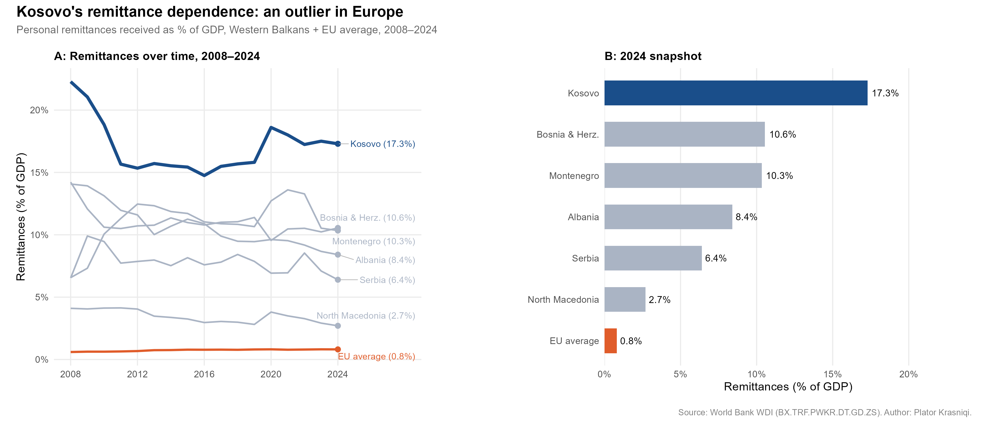

# Kosova's remittance dependence: an outlier in Europe

Descriptive comparison of **personal remittances as a share of GDP** across the
Western Balkans and the EU average, 2008–2024, from World Bank WDI.

**The finding: Kosova's remittances have equalled 15–22% of GDP throughout the
period, consistently the highest in the Western Balkans** — against an EU
average that has remained below 1% across the same period.



> **Naming convention.** This README uses **Kosova** throughout, except in the
> Data section below, where country labels are reproduced exactly as the World
> Bank WDI publishes them — the WDI's own identifier for the entity is `XKX`,
> labelled "Kosovo".

## Question

How dependent is Kosova on remittances relative to its Western Balkans
neighbours and the EU average, and has that dependence changed over time?

## Data

- Source: World Bank World Development Indicators
- Indicator: `BX.TRF.PWKR.DT.GD.ZS` — Personal remittances received (% of GDP)
- Countries: Kosovo, Albania, North Macedonia, Bosnia & Herzegovina, Serbia,
  Montenegro, EU average
- Period: 2008–2024
- Access: `wbstats` R package — no manual download required

The EU comparator is the WDI's European Union aggregate (`EUU`), not an
individual member state.

## Key findings

- Kosova's remittances have equalled 15–22% of GDP throughout the period,
  consistently the highest in the Western Balkans
- The EU average has remained below 1% across the same period
- Despite sustained GDP growth, Kosova's remittance share has not declined
  meaningfully — diaspora transfers are keeping pace with the economy rather
  than being displaced by domestic income growth
- A modest spike is visible in 2020, consistent with increased diaspora
  support during the COVID-19 contraction

## Methods

Descriptive time series and cross-sectional comparison. No causal claims made.

Panel A plots each country's series over 2008–2024 with end-of-series labels;
panel B is a 2024 cross-country snapshot.

## Reproduce

```r
install.packages(c("wbstats", "ggplot2", "dplyr", "ggrepel", "patchwork"))
source("remittances-regional-context/analysis.R")
```

The script saves its figure to the current working directory, so run it from
the folder that should hold the output.

## Outputs

- `remittances_western_balkans.png` — two-panel figure (time series and 2024
  snapshot).

## Limitations

- **Descriptive only.** The comparison shows levels and co-movement across
  countries and years. It identifies nothing about why the share has held
  steady, and no causal claim is made.
- **Recorded transfers only.** The WDI indicator captures remittances recorded
  through formal channels; transfers carried informally are not observed in it.
- **A ratio moves with its denominator.** Remittances are expressed as a share
  of GDP, so a flat share is consistent with remittances and GDP growing
  together — as the third finding notes — rather than with either being static.
- **Compiled secondary source.** WDI assembles figures supplied by national
  authorities and international bodies; values for a given year can be revised
  in later WDI vintages, so a re-run may not reproduce these numbers exactly.

---

*Data: World Bank World Development Indicators. Analysis: Plator Krasniqi.*
