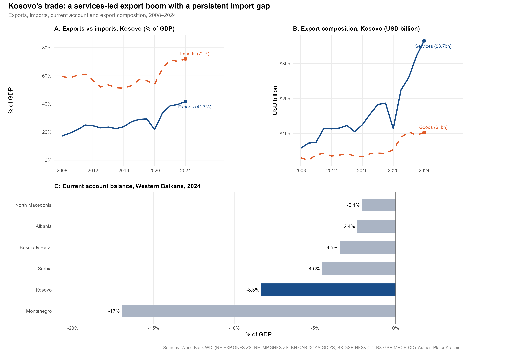

# Kosova's trade: a services-led export boom with a persistent import gap

Descriptive account of how **Kosova's export structure has changed since 2008**,
using World Bank WDI trade and current-account series, with a 2024 Western
Balkans comparison.

**The finding: Kosova's exports grew from 17% to 42% of GDP between 2008 and
2024, a genuine structural shift** — one in which services, not goods, account
for the bulk of export value.



> **Naming convention.** This README uses **Kosova** throughout, except in the
> Data section below, where country labels are reproduced exactly as the World
> Bank WDI publishes them — the WDI's own identifier for the entity is `XKX`,
> labelled "Kosovo".

## Question

How has Kosova's export structure evolved since 2008, and what does the
composition of exports — services versus goods — reveal about the nature
of Kosova's external sector?

## Data

- Source: World Bank World Development Indicators
- Indicators:
  - `NE.EXP.GNFS.ZS` — Exports of goods and services (% of GDP)
  - `NE.IMP.GNFS.ZS` — Imports of goods and services (% of GDP)
  - `BN.CAB.XOKA.GD.ZS` — Current account balance (% of GDP)
  - `BX.GSR.NFSV.CD` — Service exports (current USD)
  - `BX.GSR.MRCH.CD` — Goods exports (current USD)
- Countries: Kosovo (panels A and B); Western Balkans six (panel C)
- Period: 2008–2024

## Key findings

- Kosova's exports grew from 17% to 42% of GDP between 2008 and 2024,
  a genuine structural shift
- Services dominate: in 2024, Kosova exported $3.7bn in services versus
  $1.0bn in goods — a ratio of 3.5 to 1
- Services exports have grown sixfold since 2008; goods exports threefold
- Despite export growth, the import gap has not closed — imports reached
  72% of GDP in 2024
- Kosova's current account deficit of -8.3% of GDP is the second largest
  in the Western Balkans in 2024, after Montenegro (-17.0%)
- Read alongside [`remittances-regional-context/`](../remittances-regional-context):
  remittances equivalent to 17% of GDP are a significant part of what finances
  this persistent import gap

## Methods

Descriptive time series and cross-sectional comparison. No causal claims made.

Panels A and B cover Kosova alone — exports against imports as a share of GDP,
and services against goods exports in current USD. Panel C is a 2024
current-account comparison across the Western Balkans six.

## Reproduce

```r
install.packages(c("wbstats", "ggplot2", "dplyr", "tidyr", 
                   "ggrepel", "patchwork", "scales"))
source("trade-structure/analysis.R")
```

Two things to know before running: the script clears the workspace
(`rm(list=ls())`) and calls `install.packages("scales")` at the top on every
run, and it saves its figure to the current working directory — so run it from
the folder that should hold the output.

## Outputs

- `kosovo_trade_structure.png` — three-panel figure (exports vs imports; export
  composition; 2024 current account across the Western Balkans).

## Limitations

- **Descriptive only.** The piece shows how the composition of trade has shifted
  and how Kosova compares in 2024. It does not identify what produced the shift,
  and no causal claim is made.
- **Current USD, not volumes.** Services and goods exports are reported in
  current USD and are not deflated, so the sixfold and threefold growth figures
  combine price and volume changes.
- **Shares of GDP move with the denominator.** Exports and imports are expressed
  as a share of GDP, so the ratios respond to changes in GDP as well as to trade
  flows.
- **Panel C is a single year.** The current-account comparison is a 2024
  snapshot, not a trend, and country rankings on it can move year to year.
- **Compiled secondary source.** WDI assembles figures supplied by national
  authorities and international bodies; values for a given year can be revised
  in later WDI vintages, so a re-run may not reproduce these numbers exactly.

---

*Data: World Bank World Development Indicators. Analysis: Plator Krasniqi.*
